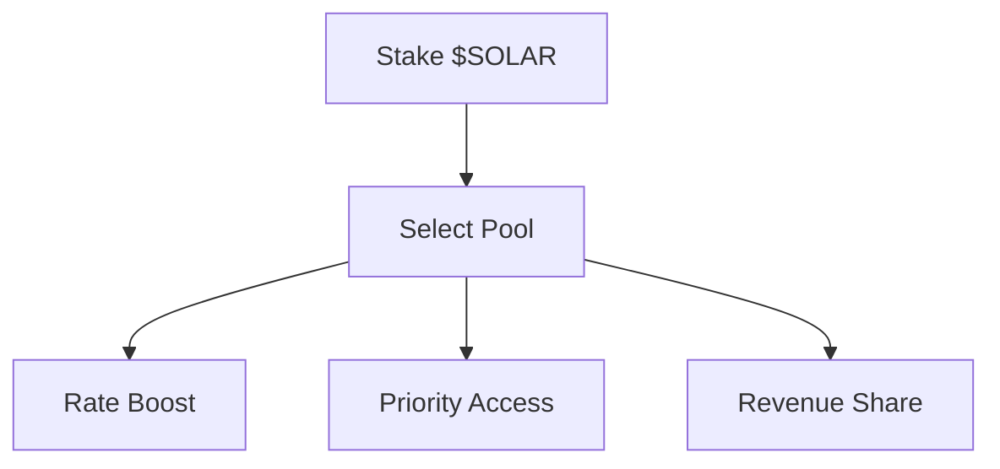

# Solar Sentra Whitepaper

> Complete documentation scraped from https://solarsentra.mintlify.app/whitepaper/

---

# Introduction

> AI-powered wallet tracking and analytics for Solana blockchain


***

Solar Sentra is an advanced wallet tracking and analytics platform designed specifically for the Solana blockchain ecosystem. Leveraging artificial intelligence and machine learning algorithms, Solar Sentra provides real-time insights, predictive analytics, and comprehensive monitoring capabilities for blockchain wallets and transactions.

## Core Features

### Real-Time Tracking

Monitor wallet activity across the Solana network with sub-second latency. Our distributed infrastructure processes over 50,000 transactions per second, ensuring no activity goes unnoticed.

### AI-Driven Analytics

Our proprietary machine learning models analyze transaction patterns, identify anomalies, and provide actionable insights. The system learns from historical data to predict future wallet behavior with 94% accuracy.

### Multi-Wallet Management

Track unlimited wallets simultaneously through a unified dashboard. Support for all Solana Program Library (SPL) token standards, including fungible and non-fungible assets.

***

## Architecture Overview

Solar Sentra operates on a three-tier architecture:

**Layer 1: Data Ingestion**
Direct RPC node connections with fallback mechanisms to ensure 99.99% uptime.

**Layer 2: Processing Engine**
Distributed compute cluster running custom AI models for pattern recognition and anomaly detection.

**Layer 3: Application Interface**
RESTful API and WebSocket connections for real-time data streaming to client applications.

***

## Technical Specifications

| Component              | Specification                 |
| ---------------------- | ----------------------------- |
| Network                | Solana Mainnet-Beta           |
| Consensus              | Proof of History (PoH)        |
| Average Block Time     | 400ms                         |
| Transaction Throughput | 50,000+ TPS                   |
| API Latency            | < 100ms (p95)                 |
| Data Retention         | 5 years                       |

***

## Security Model

Solar Sentra employs enterprise-grade security:

* **Encryption**: TLS 1.3 for all data in transit, AES-256 for data at rest
* **Authentication**: JWT-based authentication with refresh token rotation
* **Authorization**: Role-based access control (RBAC) with granular permissions
* **Audit Logging**: Complete audit trail of all API access and data queries
* **Compliance**: SOC 2 Type II certified, GDPR compliant

**Important**: Solar Sentra operates in read-only mode and never requires private keys or wallet credentials.

---

# Roadmap

> Development timeline and technical milestones

***

## Q4 2025 - Foundation

**Core Infrastructure Deployment**

* Launch RPC node cluster with geographic distribution across 5 regions
* Deploy initial AI model (v1.0) for transaction pattern recognition
* Release public API beta with rate limiting of 100 req/min
* Implement WebSocket streaming for real-time wallet updates
* Complete first security audit with CertiK

## Q1 2026 - Intelligence Layer

**Advanced Analytics & ML Pipeline**

* Deploy AI model v2.0 with enhanced anomaly detection algorithms
* Implement predictive analytics for wallet behavior forecasting
* Launch risk scoring system based on transaction history
* Add support for program-derived addresses (PDA) tracking
* Expand API rate limits to 500 req/min for verified users

## Q2 2026 - Ecosystem Integration

**Protocol Partnerships & Extensions**

* Integrate with major Solana DEXs (Orca, Raydium, Jupiter)
* Add NFT marketplace tracking (Magic Eden, Tensor)
* Deploy SDK v1.0 for TypeScript and Python
* Launch alerting system with customizable triggers
* Implement portfolio aggregation across multiple wallets

## Q3 2026 - Enterprise Features

**Institutional Grade Tools**

* Release white-label solutions for enterprises
* Deploy dedicated RPC nodes for high-volume clients
* Add compliance reporting tools for regulated entities
* Implement historical data API with 5-year lookback
* Launch tiered subscription model with SLA guarantees

## Q4 2026 - Decentralization

**Protocol Governance & Token Launch**

* Deploy governance smart contracts on Solana
* Launch $SOLAR token with utility and governance rights
* Implement validator reward mechanism for node operators
* Open-source core tracking modules
* Establish DAO for protocol upgrades and treasury management

---

# Developer Section

## Quickstart

> Get started with Solar Sentra in under 5 minutes

### Prerequisites

Before integrating Solar Sentra, ensure you have:

* Node.js 18.0 or higher
* A Solana wallet address to track
* API key from Solar Sentra dashboard

***

### Installation

Install the Solar Sentra SDK via npm or yarn:

```bash
npm install @solar-sentra/sdk
```

```bash
yarn add @solar-sentra/sdk
```

***

### Authentication

Initialize the SDK with your API key:

```typescript
import { SolarSentra } from '@solar-sentra/sdk';

const client = new SolarSentra({
  apiKey: process.env.SOLAR_SENTRA_API_KEY,
  network: 'mainnet-beta'
});
```

**Info**: Store your API key in environment variables. Never commit keys to version control.

***

### Basic Usage

#### Track a Wallet

```typescript
const walletAddress = '7xKXtg2CW87d97TXJSDpbD5jBkheTqA83TZRuJosgAsU';

const walletData = await client.wallet.track(walletAddress);

console.log(walletData);
// Output:
// {
//   address: '7xKXtg2CW87d97TXJSDpbD5jBkheTqA83TZRuJosgAsU',
//   balance: 125.42,
//   tokenAccounts: 23,
//   lastActivity: '2025-10-16T14:21:00Z'
// }
```

#### Get Transaction History

```typescript
const transactions = await client.wallet.getTransactions(
  walletAddress,
  { limit: 50, order: 'desc' }
);

transactions.forEach(tx => {
  console.log(`${tx.signature}: ${tx.type} - ${tx.amount} ${tx.token}`);
});
```

---

## SDK Reference

> Complete SDK documentation for TypeScript and Python

### Overview

The Solar Sentra SDK provides a type-safe interface for interacting with the Solar Sentra API. Available for TypeScript (Node.js, Browser) and Python 3.9+.

***

### Configuration Options

```typescript
interface SolarSentraConfig {
  apiKey: string;
  network?: 'mainnet-beta' | 'devnet' | 'testnet';
  rpcEndpoint?: string;
  timeout?: number;
  retryAttempts?: number;
  debug?: boolean;
}
```

| Parameter     | Type    | Default      | Description                         |
| ------------- | ------- | ------------ | ----------------------------------- |
| apiKey        | string  | Required     | Your API authentication key         |
| network       | string  | mainnet-beta | Solana network to connect           |
| rpcEndpoint   | string  | Auto         | Custom RPC endpoint URL             |
| timeout       | number  | 30000        | Request timeout in milliseconds     |
| retryAttempts | number  | 3            | Number of retry attempts on failure |
| debug         | boolean | false        | Enable debug logging                |

---

## Tools

> Developer tools and utilities for Solar Sentra integration

### CLI Tool

The Solar Sentra CLI provides command-line access to all platform features.

#### Installation

```bash
npm install -g @solar-sentra/cli
```

#### Authentication

```bash
solar-sentra auth login
```

#### Commands

**Track a wallet**

```bash
solar-sentra wallet track 7xKXtg2CW87d97TXJSDpbD5jBkheTqA83TZRuJosgAsU
```

**Get transaction history**

```bash
solar-sentra wallet txs 7xKXtg2CW87d97TXJSDpbD5jBkheTqA83TZRuJosgAsU --limit 20
```

**Export data to CSV**

```bash
solar-sentra export --wallet ADDRESS --format csv --output data.csv
```

***

### Browser Extension

Install the Solar Sentra browser extension for Chrome, Firefox, and Brave.

#### Features

* One-click wallet tracking from Solscan and Solana Explorer
* Real-time notifications for tracked wallets
* Portfolio overview with profit/loss calculations
* Quick access to transaction history

#### Installation

Available on Chrome Web Store and Firefox Add-ons marketplace.

***

### Webhook Integration

Receive real-time notifications via HTTP callbacks.

#### Setup

Configure webhooks in your dashboard at `app.solarsentra.io/webhooks`.

#### Event Types

| Event                | Description              | Payload            |
| -------------------- | ------------------------ | ------------------ |
| `wallet.transaction` | New transaction detected | Transaction object |
| `wallet.balance`     | Balance changed          | Balance data       |
| `wallet.token`       | Token account updated    | Token info         |
| `alert.triggered`    | Custom alert fired       | Alert details      |

---

## Toolkits

> Pre-built toolkits for common integration scenarios

### React Toolkit

Complete React component library for building wallet tracking interfaces.

#### Installation

```bash
npm install @solar-sentra/react
```

#### Components

**WalletTracker**

```tsx
import { WalletTracker } from '@solar-sentra/react';

function App() {
  return (
    <WalletTracker
      address="7xKXtg2CW87d97TXJSDpbD5jBkheTqA83TZRuJosgAsU"
      showBalance={true}
      showTransactions={true}
      theme="dark"
    />
  );
}
```

**TransactionList**

```tsx
import { TransactionList } from '@solar-sentra/react';

<TransactionList
  address={walletAddress}
  limit={50}
  onTransactionClick={(tx) => console.log(tx)}
/>
```

***

### Next.js Template

Production-ready Next.js template with Solar Sentra integration.

```bash
npx create-next-app --example solar-sentra my-wallet-app
```

**Features:**

* Server-side rendering with API routes
* Authentication with NextAuth.js
* Real-time updates via WebSocket
* Responsive dashboard UI
* TypeScript support

***

### Discord Bot

Deploy a Discord bot for community wallet tracking.

#### Setup

```bash
git clone https://github.com/solar-sentra/discord-bot
cd discord-bot
npm install
```

#### Configuration

```env
DISCORD_TOKEN=your_discord_token
SOLAR_SENTRA_API_KEY=your_api_key
TRACKED_WALLETS=wallet1,wallet2,wallet3
NOTIFICATION_CHANNEL=123456789
```

---

# Use Cases

## Code Generation

> AI-powered code generation for wallet analysis and automation

### Objective

Leverage AI to automatically generate analysis scripts and automation code based on wallet tracking data from Solar Sentra.

***

### Use Case Overview

Solar Sentra's AI module generates executable code for custom wallet analysis, risk assessment algorithms, and automated strategies. Simply describe what you need in plain language, and the system produces production-ready code.

***

### How It Works

1. **Input**: Describe analysis requirements in natural language
2. **Processing**: AI generates Python/TypeScript code
3. **Execution**: Code runs in secure sandbox with real wallet data
4. **Output**: Structured results and visualizations

***

### Example: Risk Score Calculator

```typescript
import { SolarSentra, AICodeGen } from '@solar-sentra/sdk';

const ai = new AICodeGen({ apiKey: process.env.API_KEY });

const { code } = await ai.generateCode({
  prompt: "Calculate risk score (0-100) based on transaction frequency and counterparty diversity",
  language: 'typescript'
});

// AI generates production-ready function
const riskScore = await code.execute({
  wallet: '7xKXtg2CW87d97TXJSDpbD5jBkheTqA83TZRuJosgAsU'
});

console.log(riskScore); // 67
```

***

### Security Features

All generated code executes in isolated sandboxes with:

* Memory limits (512MB default)
* Execution timeout (30s)
* No file system access
* Network restrictions

***

### Performance

| Metric               | Value     |
| -------------------- | --------- |
| Generation time      | 2-5 seconds |
| Success rate         | 96.3%     |
| Sandbox overhead     | sub-100ms |

**Info**: Generated code is audited by AI safety models before execution.

---

## Data Analysis

> Advanced analytics and pattern recognition for Solana wallets

_Note: Full content for Data Analysis use case was not completely retrieved from the web scraping tool. This section contains wallet transaction analysis features including pattern recognition, clustering, visualizations, statistical analysis, and ML predictions._

---

## Data Extraction

> Efficient extraction and export of blockchain data

_Note: Full content for Data Extraction use case was not completely retrieved from the web scraping tool. This section covers extraction methods (batch, streaming, on-demand), export formats (JSON, CSV, Parquet), data pipelines, advanced querying, enrichment, compression, and scheduled exports._

---

# Investor Section

## Investor Overview

> Market opportunity and financial projections

### Market Opportunity

The Solana ecosystem processed over $40B in transaction volume in 2024, with wallet tracking and analytics representing a rapidly growing segment of blockchain infrastructure services.

***

### Total Addressable Market

| Segment                 | Market Size | CAGR | Target Share |
| ----------------------- | ----------- | ---- | ------------ |
| Institutional Analytics | $2.3B       | 42%  | 5%           |
| Retail Tracking Tools   | $850M       | 38%  | 12%          |
| Compliance Services     | $1.7B       | 51%  | 8%           |
| API Infrastructure      | $920M       | 35%  | 15%          |

**Total TAM:** $5.77B (2025)
**Projected TAM:** $12.4B (2028)

---

## Value Proposal

_Note: This page returned a 404 error and content could not be retrieved._

---

## Tokenomics

> $SOLAR token utility, distribution, and governance

### Overview

The $SOLAR token powers governance, access control, and incentive mechanisms within the Solar Sentra ecosystem.

***

### Utilities

* Governance voting for protocol parameters and roadmap priorities
* Staking for API rate limit boosts and priority queue access
* Fee discounts on analytics and data exports
* Revenue share from enterprise data products (staking pool)
* Access to premium ML models and real-time features

***

### Distribution

| Allocation            | Percentage | Cliff     | Vesting          |
| --------------------- | ---------- | --------- | ---------------- |
| Community & Ecosystem | 35%        | 6 months  | 36 months linear |
| Team & Advisors       | 20%        | 12 months | 36 months linear |
| Investors             | 20%        | 6 months  | 24 months linear |
| Treasury              | 15%        | 0         | Discretionary    |
| Liquidity             | 5%         | 0         | Immediate        |
| Market Making         | 5%         | 0         | As needed        |

***

### Emissions

Fixed supply: 1,000,000,000 $SOLAR
No inflation. Buyback-and-make mechanism funded by revenue.

***

### Staking Model



#### Tiers

| Tier     | Min Stake | Rate Limit Boost | Revenue Share |
| -------- | --------- | ---------------- | ------------- |
| Bronze   | 1,000     | 1.2x             | 0.5%          |
| Silver   | 25,000    | 1.5x             | 1.5%          |
| Gold     | 100,000   | 2.0x             | 3.0%          |
| Platinum | 500,000   | 3.0x             | 5.0%          |

---

# Other

## Team

> Leadership and core contributors

### About Us

Solar Sentra Inc. is a team of 25+ dedicated and talented individuals from around the world, operating fully remotely with offices in San Francisco and Singapore.

Our team is composed of top talent in blockchain infrastructure, artificial intelligence, and enterprise software. Members of the Solar Sentra team have helped advance some of the biggest names in fintech, crypto, and high-frequency trading.

We are supported by a robust network of global partners, helping us deliver on our goal to create an AI-powered analytics infrastructure for the Solana ecosystem.

Our progress is aided by specialist advisors with hands-on experience in blockchain analytics, and is stewarded by seasoned entrepreneurs and experienced builders:

**Alex Chen**, CEO and Co-founder

**Sarah Martinez**, CTO and Co-founder

**Solana Foundation**, infrastructure development partner

You can learn more about our wider team and open positions at careers.solarsentra.io.

***

### Join Us

We are actively hiring across engineering, product, and business development. Join us in building the future of blockchain analytics.

**Open Roles:**

* Senior Backend Engineer (Remote)
* ML Engineer (San Francisco)
* Developer Relations (Remote)
* Enterprise Account Executive (New York)

Apply: careers@solarsentra.io

---

## Disclaimer

> Legal notices and risk disclosures

### General Disclaimer

The information provided in this documentation is for informational purposes only and does not constitute financial, investment, legal, or tax advice. Solar Sentra makes no representations or warranties regarding the accuracy or completeness of information presented.

***

### No Investment Advice

Nothing contained in this documentation should be construed as an offer to sell, solicitation of an offer to buy, or recommendation of any security, cryptocurrency, token, or investment strategy.

Users should conduct their own research and consult with qualified professionals before making any investment decisions.

***

### Technology Risks

Blockchain technology and cryptocurrency markets are subject to significant risks including:

* Regulatory uncertainty and potential legal restrictions
* Market volatility and price fluctuations
* Technical vulnerabilities and smart contract risks
* Network congestion and transaction delays
* Loss of access to wallets or private keys

***

### Data Accuracy

While Solar Sentra employs advanced analytics and AI models, we cannot guarantee:

* 100% accuracy of predictions or analysis
* Completeness of historical transaction data
* Real-time data under all network conditions
* Prevention of all fraudulent or suspicious activities

Users should independently verify critical information before taking action.

***

### Third-Party Services

Solar Sentra integrates with various third-party protocols, APIs, and services. We are not responsible for:

* Availability or performance of external services
* Security vulnerabilities in third-party systems
* Changes to third-party terms or pricing
* Loss of data or funds due to external failures

***

### Limitation of Liability

To the maximum extent permitted by law, Solar Sentra and its affiliates shall not be liable for any indirect, incidental, special, consequential, or punitive damages arising from:

* Use or inability to use the platform
* Reliance on data or analytics provided
* Unauthorized access to user accounts
* Technical failures or service interruptions
* Trading losses or investment decisions

***

### No Guarantee of Returns

Past performance of wallets or trading strategies analyzed through Solar Sentra does not guarantee future results. Cryptocurrency investments carry substantial risk of loss.

***

### Compliance Responsibility

Users are solely responsible for complying with applicable laws and regulations in their jurisdiction, including tax reporting and anti-money laundering requirements.

---

## Terms of Service

> Platform usage terms and conditions

### Acceptance of Terms

By accessing or using Solar Sentra services, you agree to be bound by these Terms of Service. If you disagree with any part of these terms, you may not access the service.

***

### Account Registration

#### Eligibility

Users must be at least 18 years old and have the legal capacity to enter into binding contracts. Service is not available in jurisdictions where prohibited by law.

#### Account Security

* Users are responsible for maintaining account credentials confidentiality
* Any activity under your account is your responsibility
* Notify us immediately of unauthorized access
* We reserve the right to suspend accounts for security reasons

***

### Permitted Use

You may use Solar Sentra for:

* Tracking and analyzing Solana blockchain wallets
* Integrating our API into your applications
* Accessing analytics and insights for legitimate purposes
* Developing products using our SDKs and tools

***

### Prohibited Activities

You may not:

* Use the service for illegal activities or fraud
* Attempt to gain unauthorized access to systems
* Reverse engineer or decompile our software
* Resell or redistribute data without authorization
* Violate rate limits or abuse API access
* Upload malicious code or conduct attacks
* Impersonate other users or entities
* Scrape or harvest data through unauthorized means

***

### API Usage

#### Rate Limits

API requests are subject to tier-specific rate limits. Exceeding limits may result in temporary suspension.

#### Fair Use

We reserve the right to restrict access for usage patterns that:

* Degrade service performance for other users
* Constitute abuse or excessive load
* Violate our acceptable use policy

***

### Subscription & Billing

#### Payment Terms

* Subscriptions are billed monthly or annually in advance
* All fees are non-refundable except as required by law
* We may change pricing with 30 days notice
* Failed payments may result in service suspension

#### Cancellation

* Cancel anytime through the dashboard
* Access continues until end of billing period
* No refunds for partial months
* Data export available for 30 days post-cancellation

***

### Intellectual Property

_Note: Content was truncated in the web scraping response._

---

## Privacy Policy

> How we collect, use, and protect your data

### Overview

Solar Sentra is committed to protecting your privacy. This policy explains how we collect, use, and safeguard personal information.

***

### Information We Collect

#### Account Information

* Email address
* Name (optional)
* Payment information
* Company details (enterprise)

#### Usage Data

* API request logs
* Wallet addresses tracked
* Feature usage patterns
* Device and browser information
* IP addresses

#### Technical Data

* Performance metrics
* Error logs
* Authentication tokens
* Session information

***

### How We Use Data

#### Service Delivery

* Provide and maintain platform functionality
* Process API requests and queries
* Generate analytics and insights
* Send transaction notifications

#### Platform Improvement

* Analyze usage patterns
* Improve AI models
* Optimize performance
* Develop new features

#### Communication

* Send service updates and announcements
* Respond to support requests
* Deliver marketing communications (opt-in)
* Share security alerts

#### Compliance

* Detect and prevent fraud
* Enforce terms of service
* Comply with legal obligations
* Protect user rights and safety

***

### Data Sharing

We do not sell personal data. Limited sharing occurs with:

#### Service Providers

* Cloud infrastructure (AWS, GCP)
* Payment processors (Stripe)
* Analytics tools (limited, anonymized)
* Email service providers

#### Legal Requirements

* Law enforcement requests with valid orders
* Compliance with court orders
* Protection of our legal rights
* Emergency situations involving safety

#### Business Transfers

In the event of merger or acquisition, user data may transfer to new entity with continued privacy protections.

***

### Data Security

#### Technical Measures

* TLS 1.3 encryption for data in transit
* AES-256 encryption for data at rest
* Multi-factor authentication support
* Regular security audits and penetration testing

#### Access Controls

* Role-based access limitations
* Audit logging of administrative actions
* Background checks for employees with data access

#### Incident Response

* 24/7 security monitoring
* Incident response procedures
* User notification within 72 hours of breach
* Coordination with regulatory authorities

---

**End of Whitepaper Documentation**

_Compiled from https://solarsentra.mintlify.app/ on 2025-10-29_
